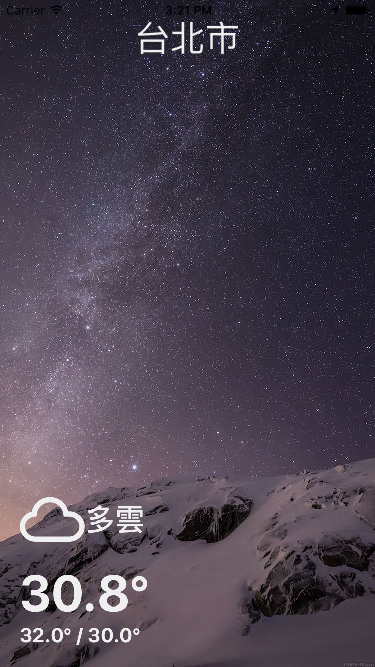

# ReactNativeWeatherApp
Weaher App developed by React Native. Inspired by these open source projects: 

1. [react-native-weather-app] (https://github.com/catalinmiron/react-native-weather-app)
2. [react-native-weather-app-1] (https://github.com/catalinmiron/react-native-weather-app-1)

# Used Components 
- [react-native-svg] (https://github.com/magicismight/react-native-art-svg)
- [react-native-swiper2] (https://github.com/sunnylqm/react-native-swiper2)

# Screenshot

# Wallpaper Source
- [FreeiOS8.com - 
ad00-wallpaper-apple-ios8-iphone6-plus-official-starry-night](http://freeios8.com/ad00-wallpaper-apple-ios8-iphone6-plus-official-starry-night/) 

# Walkthrough

GIF created with [LiceCap](http://www.cockos.com/licecap/).